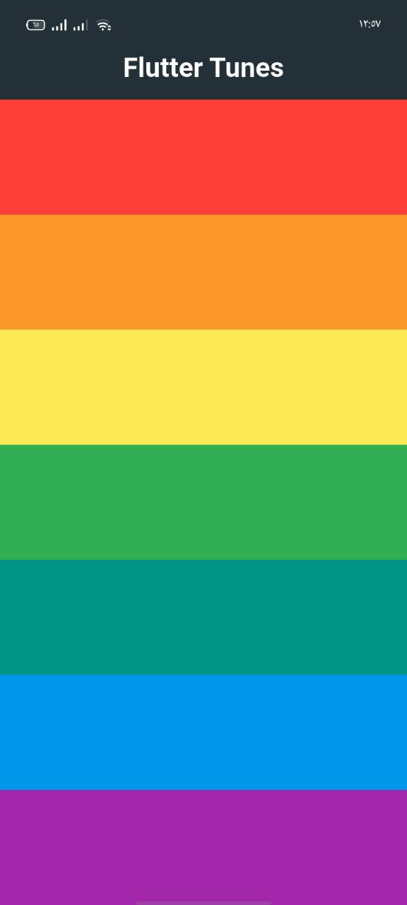

# Tunes player App 🎵

This is my third Flutter project inspired by Eng. Tharwat Samy’s course.  
In this project, I challenged myself to build the entire app on my own — and I did it successfully Alhamdulillah.

## 🚀 About the Project
Tunes App is a simple and clean Flutter application that contains:
- A single static screen
- Multiple interactive containers
- Each container plays a unique sound when clicked
- Basic UI design to practice layout, widgets, and assets handling in Flutter

## 🛠️ Technologies Used
- Flutter
- Dart

## 📚 What I Learned
- How to structure a Flutter project
- Dealing with assets (sounds + images)
- Using GestureDetector / InkWell for interactions
- Building reusable widgets
- Improving UI layout skills

## 📸 App Screenshot
*

## 🔗 Project Link
*

---

## 🙏 Credits
Inspired by the Flutter training of **Eng. Tharwat Samy**.
